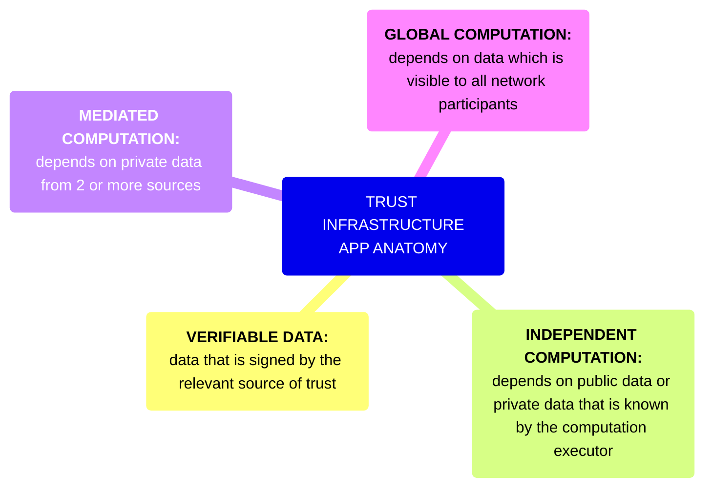
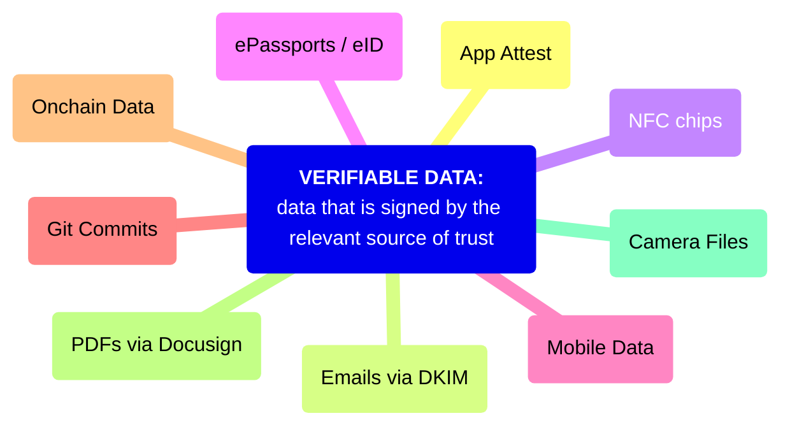
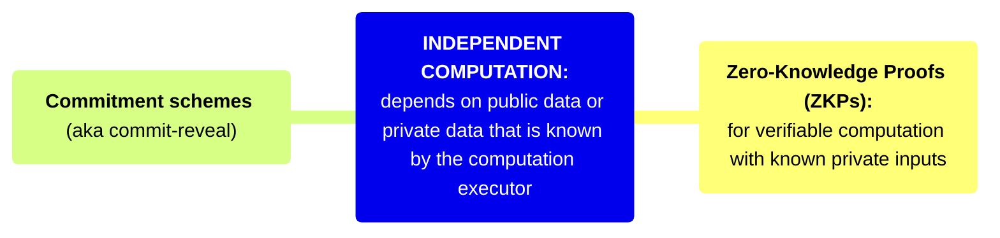
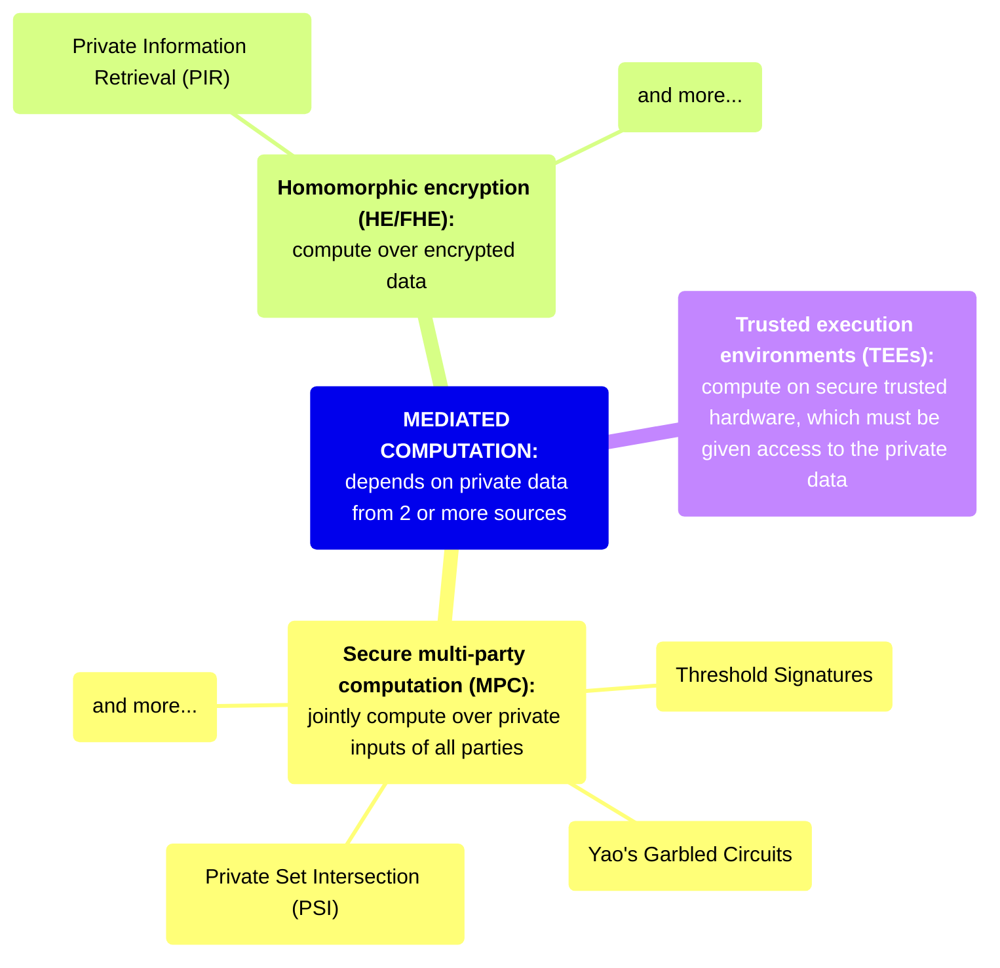
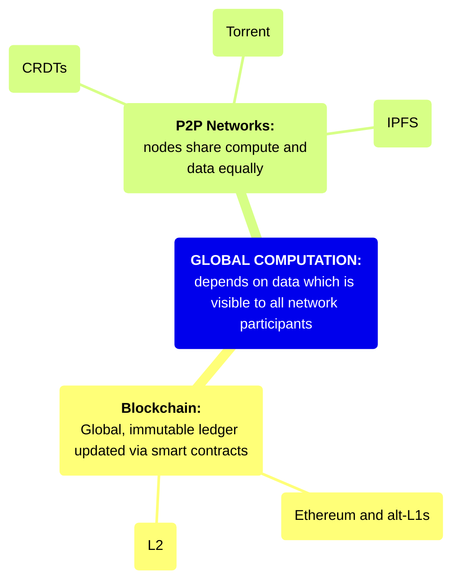
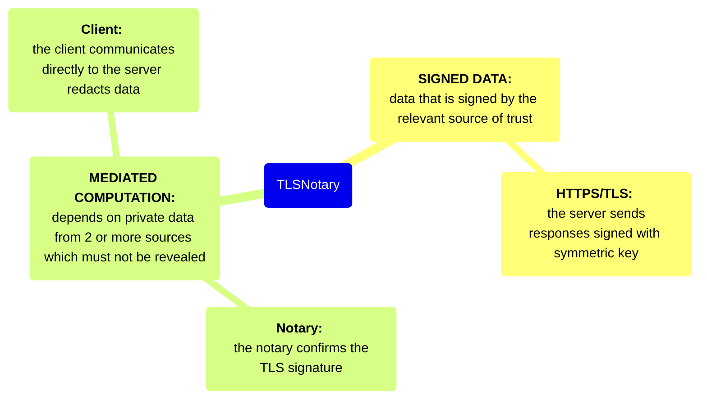

Anatomy of a Trust Infrastructure Application

# Introduction

This document presents an overview of trust infrastructure technology and application landscape. Throughout this document, we use the computational framework from [SoK: Programmable Privacy in Distributed Systems](https://eprint.iacr.org/2024/982.pdf).

We first describe the [core technologies](https://www.notion.so/Anatomy-of-a-Trust-Infrastructure-Application-9734381a82904f18926cb3db460f546b?pvs=21) underpinning trust infrastructure protocols and applications to understand the material and techniques available to us.

We then describe the [applications](https://www.notion.so/Anatomy-of-a-Trust-Infrastructure-Application-9734381a82904f18926cb3db460f546b?pvs=21), [protocols and developer tools](https://www.notion.so/Anatomy-of-a-Trust-Infrastructure-Application-9734381a82904f18926cb3db460f546b?pvs=21) available to prime our thinking on common patterns and what larger components exist ready for use off-the-shelf.

# Trust Infrastructure App Anatomy

## Verifiable Data

Verifiable data is data that is attested to by a known and trusted source. It provides a cryptographic guarantee (usually a digital signature) that it has not been modified since leaving the source. Sources of verifiable data can be anything from a government (electronic ID) to an individual to a device.

- [Apple’s App Attest](https://developer.apple.com/documentation/devicecheck/establishing-your-app-s-integrity)
- Camera Files
    - [Content Credentials](https://contentcredentials.org/)
- Credit Card Transactions via [EMV](https://en.wikipedia.org/wiki/EMV)
- [Emails (DKIM signature)](https://en.wikipedia.org/wiki/DomainKeys_Identified_Mail)
    - [zkEmail](https://prove.email/)
- [Ethereum Attestation Service](https://attest.org/), including:
    - [Coinbase](https://help.coinbase.com/en/coinbase/getting-started/verify-my-account/onchain-verification)
    - [Gitcoin Passport](https://passport.gitcoin.co/)
    - [Optimism Bedrock](https://docs.optimism.io/chain/identity/contracts-eas)
    - [and more…](https://attest.org/ecosystem)
- [Git Commits](https://docs.github.com/en/authentication/managing-commit-signature-verification)
- HTTPS/TLS: by default, this data cannot be shared in a verifiable manner, but several projects aim to add a protocol on top of TLS to make the received data verifiable.
    - [TLS Notary](https://tlsnotary.org/)
    - [Pluto](https://pluto.xyz/)
    - [Reclaim Protocol](https://www.reclaimprotocol.org/)
- Electronic ID:
    - [Biometric Passports (ePassports)](https://en.wikipedia.org/wiki/Biometric_passport)
    - Many government ID Cards:
        - [A global list of countries with eID](https://en.wikipedia.org/wiki/Electronic_identification)
        - EU [Residence Cards](https://eur-lex.europa.eu/legal-content/EN/TXT/PDF/?uri=CELEX:32017R1954) for foreign nationals
        - [eIDAS](https://digital-strategy.ec.europa.eu/en/policies/eidas-regulation) (future electronic id cards for EU citizens)
        - [India (Aadhar)](https://en.wikipedia.org/wiki/Aadhaar)
        - [Japan (My Number Card)](https://en.wikipedia.org/wiki/Individual_Number_Card)
        - [Taiwan](https://github.com/moda-gov-tw/tw-did)
- Mobile App Data
- [NFC Chips](https://en.wikipedia.org/wiki/Near-field_communication)
- Onchain Data
- PDFs via [Docusign](https://www.docusign.com/how-it-works/electronic-signature/digital-signature/digital-signature-faq)

### References

https://github.com/cursive-team/stuff-with-signatures?tab=readme-ov-file

## Independent Computation

Independent computation is done by a single entity, so only that entity needs access to input data. Zero-Knowledge Proofs can be used to maintain privacy over the input data.

### Zero-Knowledge Proofs

**Use in Trust Infrastructure**

Zero knowledge proofs are useful for when private inputs are known and we want to reveal either some statement over those inputs or to selectively reveal only part of the statement.

### Commitment schemes

(informally: “Commit-Reveal”)

**Use in Trust Infrastructure**

Commitments are a common cryptographic primitive. Think of it like putting a message in a locked box and then giving the box to a receiver. Later, the receiver can open the box when the sender gives them a key.

**Technical Description**

Commitment schemes consist of two phases:

1. The *commit phase*, where a value is chosen and committed to — (e.g. the player *commits* to a value)
    1. Commitments make use of the *binding property.* This means the sender cannot cheat during the reveal phase and open the commitment to a different value than was initially chosen.
2. The *reveal phase* during which the value is revealed by the sender, then the receiver verifies its authenticity.
    1. Commitments also make use of the *hiding property.* This means the receiver cannot open the commitment (and reveal inside) until the sender allows them to do so.

### References

[Intro to Zero Knowledge](https://consensys.io/blog/introduction-to-zk-snarks)

[ZK Math Intution](https://vitalik.eth.limo/general/2021/01/26/snarks.html)

[ZK Whiteboard Sessions](https://zkhack.dev/whiteboard/)

[Resources from the 0xPARC Applied Learning Group](https://learn.0xparc.org/)

[ZK Docs](https://www.zkdocs.com/)

[ZK Jargon Decoder](https://nmohnblatt.github.io/zk-jargon-decoder/)

[Proofs, Arguments, and Zero Knowledge by Justin Thaler](https://people.cs.georgetown.edu/jthaler/ProofsArgsAndZK.pdf)

## Mediated Computation

Mediated computation is used when the input data originates with multiple parties and must be kept private from all other parties. A variety of technologies can be used to achieve private mediated computation, and these can also often be combined together or with ZKPs, depending on the requirements of the application.

### Homomorphic Encryption

Homomorphic encryption is a form of encryption that allows computations to be performed on encrypted data without first having to decrypt it.

### Secure Multi-Party Computation (MPC)

Secure MPC protocols typically use [secret sharing](https://en.wikipedia.org/wiki/Secret_sharing) at their core, sometimes combined with [oblivious transfer](https://en.wikipedia.org/wiki/Oblivious_transfer). At a high level, the input data is split up into secret shares which are distributed to all parties. Next, a circuit is evaluated in MPC using operation-specific techniques to compute each gate over the secret-shared values. When the circuit evaluation is complete, each party holds a secret share of the circuit’s output, and these can be used to get the output of the computation.

There are a number of generic protocols for MPC, as well as custom protocols for specific use-cases of MPC, such as Private Set Intersection and Threshold Signatures.

Fundamental protocols [[source](https://securecomputation.org/docs/ch3-fundamentalprotocols.pdf)]:

- Yao's Garbled Circuits Protocol
- Goldreich-Micali-Wigderson (GMW) Protocol
- BGW protocol
- MPC From Preprocessed Multiplication Triples
- Constant-Round Multi-Party Computation: BMR
- Information-Theoretic Garbled Circuits
- Oblivious Transfer

**Threshold signatures**

The idea in a threshold scheme is to divide a secret $S$ into $n$ pieces of data $S_1,...,S_n$ in such a way that:

1. Knowledge of any $k$ or more shares $S_i$ makes $S$ computable.
2. Knowledge of any $k - 1$ or fewer shares $S_i$ leaves $S$ completely undetermined.

[[source](https://en.wikipedia.org/wiki/Shamir%27s_secret_sharing)]

Threshold schemes are the foundation of threshold key cryptography. Threshold cryptosystems protect information by encrypting and distributing secrets amongst a cluster of independent computers that qualify as fault-tolerant. The fault-tolerance of a system simply means the system’s ability to continue operating despite failures or malfunctions.

[[source](https://blog.pantherprotocol.io/threshold-cryptography-an-overview/)]

Threshold schemes become threshold *cryptosystems* when combined with a decryption or signature protocol.

Consider a scenario in which $N$ parties each hold shards of a key. The key was used to encrypt some information (such as the location of a secret treasure). These $N$ parties agree to cooperate in decrypting this information only if a player can prove they are located near the secret treasure.

### Trusted Execution Environments

A trusted execution environment (TEE) is an area on the main processor of a device that is separated from the system's main operating system (OS). It ensures data is stored, processed and protected in a secure environment. TEEs provide protection for anything connected, such as a trusted application (TA), by enabling an isolated, cryptographic electronic structure and end-to-end security. This includes the execution of authenticated code, confidentiality, authenticity, privacy, system integrity and data access rights.

[[source](https://www.techtarget.com/searchitoperations/definition/trusted-execution-environment-TEE)]

While there is a spectrum of functionality across TEEs, the most general case is something like the above. The trusted execution environment is physically isolated from the rest of the hardware. OS and all interfaces into shared RAM, disk etcetera ensure the information is first encrypted, either using hardware keys or some provisioned key that only the trusted environment can access.

This means, in practice, a TEE allows for fully confidential, tamper-proof compute by an untrusted server (e.g. cloud provider). This unlocks a different method for “shared private state” by allowing arbitrary functions to be computed over encrypted data, but in a much more centralised fashion than in MPC. 

Combining TEEs with MPC can be a powerful combination when stronger decentralisation guarantees are a requirement and may ameliorate some of the central party risks involved.

In theory, the provider will not be able to see the data or know what the code is computing. However, in practice, physical access to the device does offer unique attack vectors which are less present in the purely cryptographic schemes. Furthermore, the semiconductor industry is tightly controlled. Relying on a few chip manufacturers to securitise the world’s information (even under the presence of auditors) comes with unique risks. Furthermore (and for that reason), in the context of crypto TEEs may be “memetically suboptimal”, as [suggested](https://ethresear.ch/t/2fa-zk-rollups-using-sgx/14462) by Justin Drake. We also recommend this counterview from [Andrew Miller](https://www.youtube.com/watch?v=4qgPd5kcwBs).

Already TEEs are widely available in mobile phones, but generally limited to supporting biometric ID — for example Apple’s [SecureEnclave](https://developer.apple.com/documentation/cryptokit/secureenclave). Cloud computing platforms are beginning to offer secure, isolated compute environments to their customers.

Overall, trusted execution environments are an appealing option to faciliate shared private state. This is especially true when considering the high cost and caveats of alternative schemes.

### **References**

[The Secret to Understanding MPC (Bain Capital Crypto Whiteboard Series with David Wong)](https://www.youtube.com/watch?v=L_ND1YPmI5E)

[Pragmatic MPC](https://securecomputation.org/)

## Global Computation

### References

# Applications and Protocols

## Primitives, Tools and Platforms

### [Semaphore](https://semaphore.pse.dev/)

---

**Capabilities**

a zero-knowledge protocol that allows you to cast a message (for example, a vote or endorsement) as a provable group member without revealing your identity.

### Storage Proofs

---

**Capabilities**

Relatively efficient for making cross-chain claims

**Present Limitations**

The verifier (on-chain or off-chain) must have access to an archive of block header hashes from the source chain.

**Companies & Projects**

Herodotus

### [TLSNotary](https://tlsnotary.org/)

---

**Capabilities**

Generates attestations over arbitrary data obtained over a TLS connection (e.g. API responses) using a designated verifier (the “notary”)

**Present Limitations**

TLS handshake during connection open for only 10 to 20s, so full MPC TLS protocol needs to be able to upload 4-10MB within 10-20s (basically, means it doesn't work nice on bad networks) In fact, MPC stuff in general not going to work for places of poor connectivity.

Need both good bandwidth and good latency — so identifying optimal Notary is point of optimization.

Can only notarize 21kb atm, so small Json responses from APIs works. More bandwidth and lower latency is needed for larger notarization lengths. Techniques in FHE or outsourcing some computation into a trustless coordinator can reduce network overhead and improve UX.

Also more efficient operations in circuit (lower constants), new techniques (IVC) and better hardware will help here as well to allow for generating proofs over larger ciphertexts.

UX issues to solve — need a clean way for users to enter into a TLS notary MPC protocol. Best approach right now is extension, but extensions do come with friction.

The notary can create arbitrary false claims by colluding with itself. Therefore TLS notary is most secure when the verifier is also the notary.

### Web Proofs

---

Prove arbitrary web data sent over TLS.

**Present Limitations**

Implementations require trust assumptions on centralized actors. Approaches either do a 2PC handshake (like TLS Notary), introducing a “designated verifier” trust assumption or they use a proxy, requiring trust in the proxy.

**Companies & Projects**

[Pluto](https://pluto.xyz/)

[Reclaim Protocol](https://www.reclaimprotocol.org/)

[zkPass](https://www.zkpass.org/)

### ZK-coprocessors

---

**Companies & Projects**

- [Axiom](https://www.axiom.xyz/)
- [Brevis](https://docs.brevis.network/)
- [Lagrange ZK Coprocessor](https://www.lagrange.dev/zk-coprocessor)
- 

### [zk-passport-circuits (Rarimo)](https://github.com/rarimo/passport-zk-circuits)

**Capabilities**

Allows for proof of biometric passport data

**Limitations**

Scanning the passport can be difficult, especially for non-technical users, since the location of the biometric chip varies by country and the location of the NFC scanner varies by phone.

### [ZKEmail](https://github.com/zkemail)

---

**Capabilities**

allows for anonymous verification of email signatures while masking specific data

**Limitations**

ZKRegex is a relatively brittle format for e-mails whose layouts and copy are frequently changed

### ZKML

---

**Capabilities**

MNIST sized inference < 1s & 180MB RAM
Decision Trees

**Present Limitations**

State of the Art CNNs from ~10 years ago?

**Companies & Projects**

EZKL

## Concrete Applications

### Airdrops on OP stack

proof of github contribution

### Backpocket

private set intersections on event emails which connect you to other friends who are also going to the event

### [Freedom Tool](https://docs.rarimo.com/ecosystem/freedom-tool/)

Private, anonymous voting with passports in elections

### [Ketl](https://github.com/BigWhaleLabs/ketl-attestation-token) or [Creddd](https://creddd.xyz/)

verified actions for whistleblowing and information sharing

### Postcard

a mobile app for sharing attested images + proof of location

### [Rarime](https://github.com/rarimo/rarime)

Self-custody identity wallet based on zk proofs of passports

### [ZKP2P](https://github.com/zkp2p)

onramp and offramp of crypto using Venmo and other money transfer applications.

### [zkPassport](https://github.com/zk-passport/proof-of-passport)

zk proof of a biometric passport’s government signature enabling users to mint a Soulbound Token.

### [ZKSummit 11 Cursive App](https://github.com/cursive-team/zk-summit)

NFC chips and PSI for networking and contact sharing

### [zuAuth](https://github.com/cedoor/zuauth)

A simple package designed to streamline the development of a zero-knowledge authentication system with Zupass tickets.

### [zuPass](https://github.com/proofcarryingdata/zupass)

keycard where entry is based on ticketing + past behavior

## Theoretical Applications

### Proof of Watermark

Embed hidden watermarks in media and then prove correct “retrieval” using ZKML or other as evidence for legal action.

### Proof of Exploit

Prove you found an exploit without revealing the exploit, useful for payment

### Loyalty Rewards

Members earn rewards through behavior such as purchases.

### RWA Tokenization

Relies on ability to bridge Web2 and Web3 world, for example, using PDFs with Docusign.

### Web3 Vampire Attacks

token to user X if they perform action Z

## Research

### Arke

https://www.youtube.com/watch?v=_TVAYEzDQMM

### ZKCreds

https://eprint.iacr.org/2022/878.pdf

## External Sources regarding Application Space

[47 use cases to save humanity](https://azt3c-st.webflow.io/blog/can-blockchains-and-zero-knowledge-help-humanity-survive-47-real-world-use-cases?utm_source=substack&utm_medium=email)

# Open Questions

- The proofs we generate are a snapshot in time, but often we are more interested in mutations and up-to-date data. How do we keep our data fresh and propagate updates?
- How can we improve the UX of Trust Infrastructure?
    - ZKEmail copy and paste raw data
    - TLSNotary clunky chrome extensions
    - etc
- What other different security design / assumptions are available?
    - Off-loading most work to 3rd party services?

# Contact

This is an internal document put together by Goblin Oats and grjte we are sharing with our friends. If you are a friend of a friend and would like to get in touch or contribute to this document then please reach out to [Tonk](https://tonk.gg).
