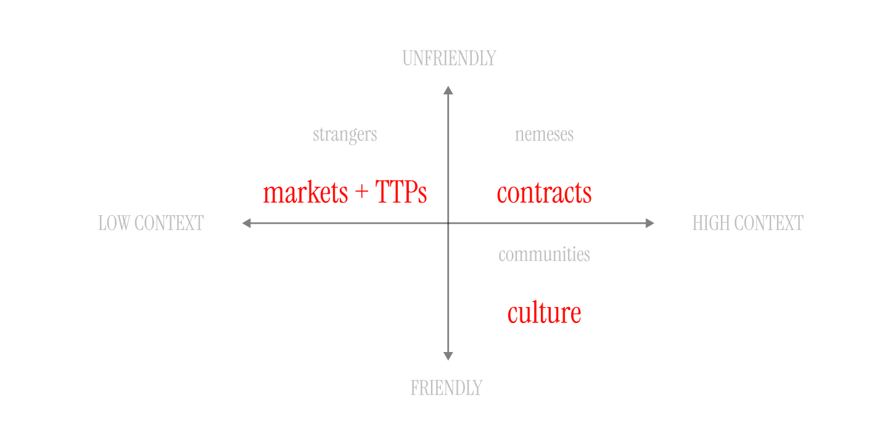
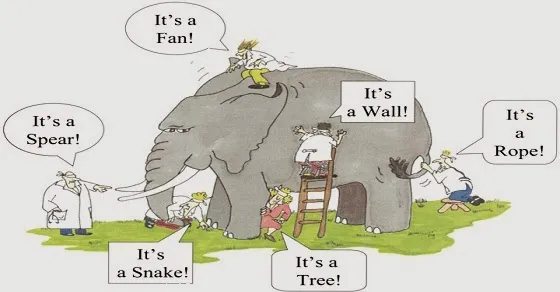

# Applications

An application is a program or piece of software designed to fulfil a *particular purpose*, but what is the purpose of an application that requires programmable cryptography and advanced decentralisation technologies? 

As of today, we only have shallow answers to this question. What has been built or speculated on uses descriptive terms around the technology and features of the technology to describe their purpose:
- It's a protocol
- It gives you provenance and authenticity
- It's a cryptographically simulated server
- It lets you own your data 
- It's a decentralized identity system

History tells us this phenomenon is present in every innovation cycle. It means we're in the early days! 

## Trust Infrastructure
The closest we have is a nascent term for an unknown portion of the application space carved out by programmable cryptography and advanced decentralisation technologies called *Trust Infrastructure*. This application space is motivated by a need to establish trust between people and systems. 

What is Trust Infrastructure? [Arnaud Schenck writes](https://gestalt.cafe/trust-infrastructure/):

>our goal should be to find ways to increase the surface area for trust building once again. We need new trust infrastructure, adapted to the world as it is.

That idea was expanded upon in a [post by Baz](https://tonk.substack.com/p/you-should-design-trust-infrastructure), where trustless design and trustful design should both be considered under the umbrella of Trust Infrastructure.

The concept of Trust Infrastructure is undoubtedly inspired by Josh Stark's talk [*Atoms, Institutions, Blockchains*](https://www.youtube.com/watch?v=Aiu8gcBlOuc) or at the very least it's tapping the same insight.

## Seeing the Elephant

Our goal in mapping the application space is to begin to chart the big *why* here and to identify the remaining gaps we must cross to fulfill the promise of these technologies. We are all seeing pieces of the puzzle, but the complete picture continues to elude.