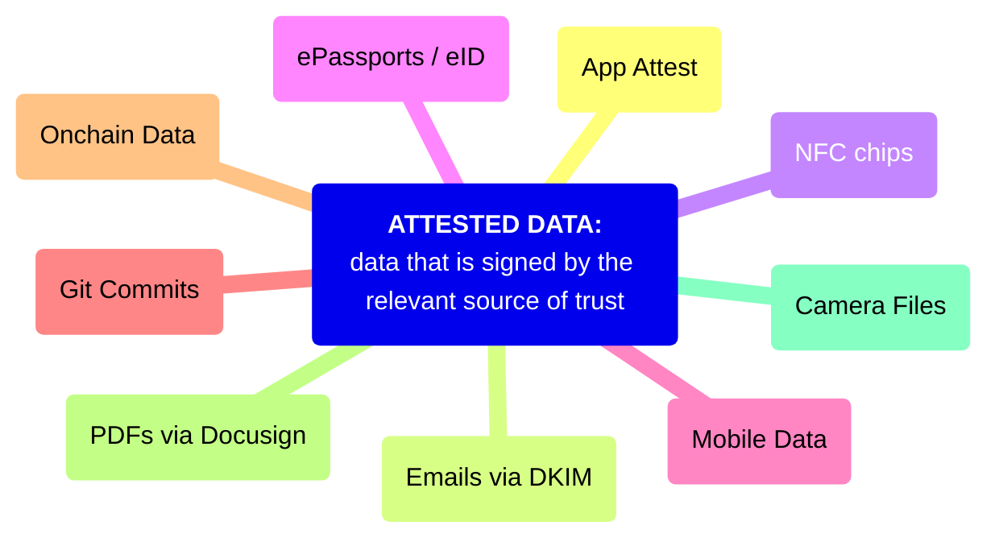

# Attested Data

## Definition

Attested data, also known as verifiable data, is data that is attested to by a known and trusted source. It provides a cryptographic guarantee (usually a digital signature) that it has not been modified since leaving the source. Sources of attested data can be anything from a government (electronic ID) to an individual to a device.

## Sources of Attested Data

- [Apple’s App Attest](https://developer.apple.com/documentation/devicecheck/establishing-your-app-s-integrity)
- Camera Files
    - [Content Credentials](https://contentcredentials.org/)
- Credit Card Transactions via [EMV](https://en.wikipedia.org/wiki/EMV)
- [Emails (DKIM signature)](https://en.wikipedia.org/wiki/DomainKeys_Identified_Mail)
    - [zkEmail](https://prove.email/)
- [Ethereum Attestation Service](https://attest.org/), including:
    - [Coinbase](https://help.coinbase.com/en/coinbase/getting-started/verify-my-account/onchain-verification)
    - [Gitcoin Passport](https://passport.gitcoin.co/)
    - [Optimism Bedrock](https://docs.optimism.io/chain/identity/contracts-eas)
    - [and more…](https://attest.org/ecosystem)
- [Git Commits](https://docs.github.com/en/authentication/managing-commit-signature-verification)
- HTTPS/TLS: by default, this data cannot be shared in a verifiable manner, but several projects aim to add a protocol on top of TLS to make the received data verifiable.
    - [TLS Notary](https://tlsnotary.org/)
    - [Pluto](https://pluto.xyz/)
    - [Reclaim Protocol](https://www.reclaimprotocol.org/)
- Electronic ID:
    - [Biometric Passports (ePassports)](https://en.wikipedia.org/wiki/Biometric_passport)
    - Many government ID Cards:
        - [A global list of countries with eID](https://en.wikipedia.org/wiki/Electronic_identification)
        - EU [Residence Cards](https://eur-lex.europa.eu/legal-content/EN/TXT/PDF/?uri=CELEX:32017R1954) for foreign nationals
        - [eIDAS](https://digital-strategy.ec.europa.eu/en/policies/eidas-regulation) (future electronic id cards for EU citizens)
        - [India (Aadhar)](https://en.wikipedia.org/wiki/Aadhaar)
        - [Japan (My Number Card)](https://en.wikipedia.org/wiki/Individual_Number_Card)
        - [Taiwan](https://github.com/moda-gov-tw/tw-did)
- Mobile App Data
- [NFC Chips](https://en.wikipedia.org/wiki/Near-field_communication)
- Onchain Data
- PDFs via [Docusign](https://www.docusign.com/how-it-works/electronic-signature/digital-signature/digital-signature-faq)
- ZK proofs attest to computation results

## References

- ["Stuff with Signatures"](https://github.com/cursive-team/stuff-with-signatures?tab=readme-ov-file) by the Cursive Team