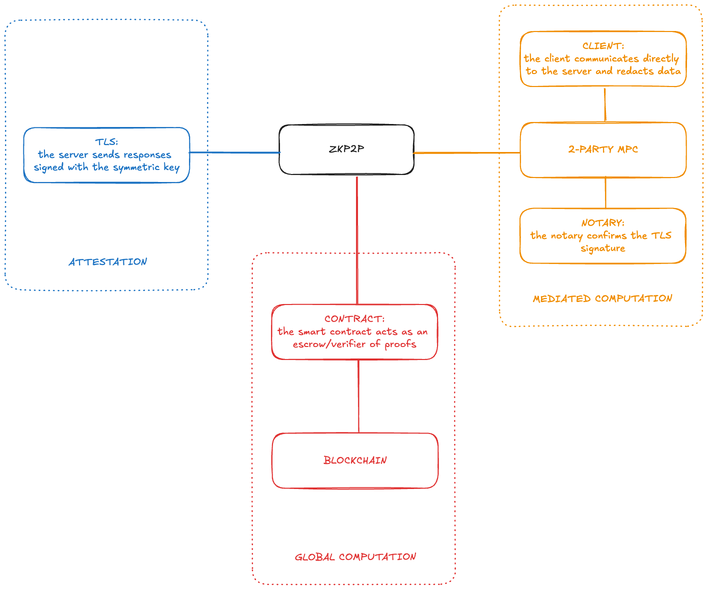
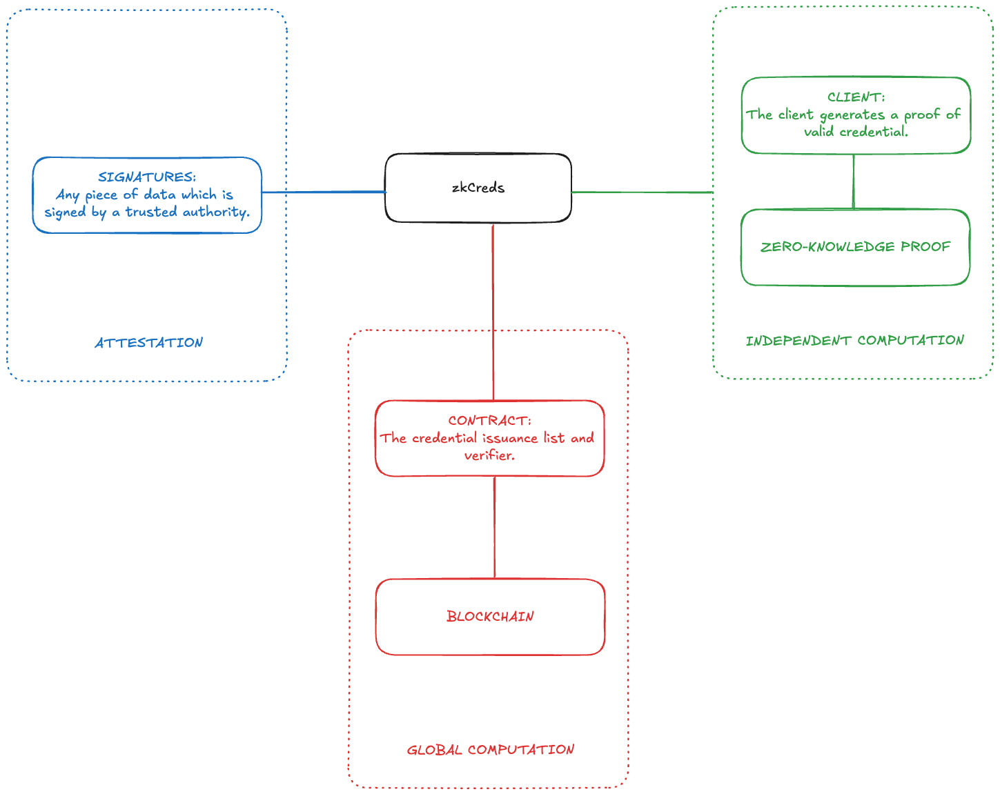
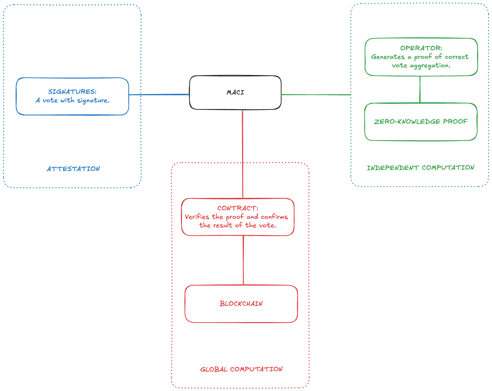

# Design Patterns
The following graphics illustrate various applications using the above framework outlined in this wiki. These design patterns are not meant to be exhaustive, but they do help us to generate examples which may ground our understanding.

## ZKP2P

## zkCreds

## MACI
