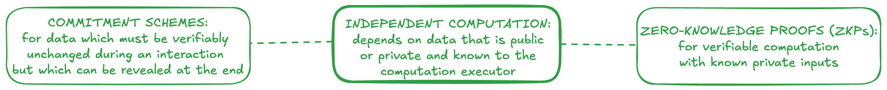

# Independent Computation

Independent computation is done by a single entity which knows all input data, both public and private. Independent computation can be used to keep data private from other actors and other parts of an application's architecture. It can also be used for verifiability when 

## Zero-knowledge proofs

Zero-knowledge proofs (ZKPs) are the most powerful form of independent computation. They enable a Prover generate an output computed over private input data, which is accompanied by a proof of the correctness of the computation, all without ever revealing the private input. A Verifier can then run a quick verification of the proof to verify that the output data was computed as claimed. In other words, ZKPs transform secrets into attestations. For more background, see the [definition](../../learning/definitions.md#zero-knowledge-proofs) and [resources](../../learning/resources.md) in the learning section.

### Use in programmable cryptography

In programmable cryptography, ZKPs can serve several purposes:
- *Transforming secrets into attestations*: Zero-knowledge proofs can be used to *transform private attestations into public attestations* that can be shared or used in mediated and global computations. For example, a ZKP may redact data by proving that private data contains or implies a fact which can be made public.
- *Producing attestations from unattested data*: ZKPs can also be used to *create an attestation from unattested data*, either public or private. In this case, the zk proof is being used for its data integrity properties.
- *Ensuring data integrity*: ZKPs can be used to prove that data is well-formed. This is useful for ensuring the integrity of inputs to other computations (such as FHE) or for providing a verifiable proof that the output from another computation is well-formed.

On its own, ZK is a tool for manipulating attestations. When combined with other types of programmable cryptography, ZKPs are usually used to process inputs to mediated/global computation or to ensure the integrity and verifiability of outputs from mediated computations.

### Caveats

### Practical challenges & limitations