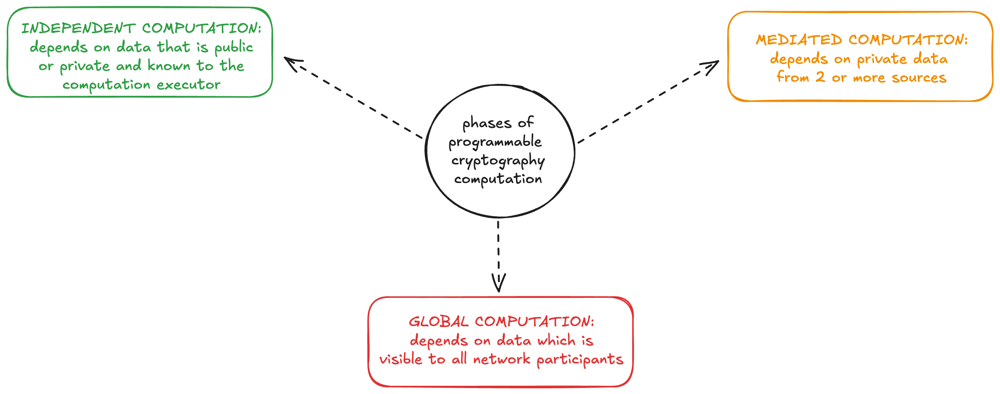
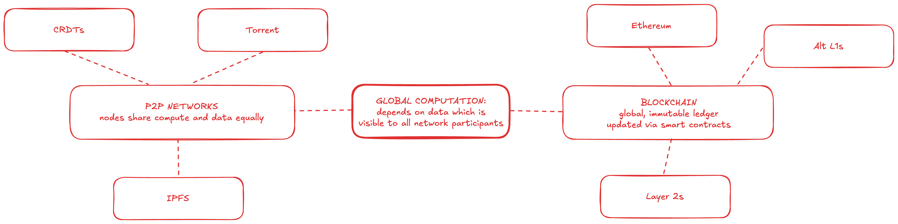

# Computation framework

We find the computation framework developed in [SoK: Programmable Privacy in Distributed Systems](https://eprint.iacr.org/2024/982.pdf) a helpful way to organize and think about the structure of these applications.

A summary of the framework via excerpts:

### What is it?
>Though it seems like there could be endless ways to fit these tools together, there turn out to be many
similarities between practical designs. We propose a lightweight framework for describing the architectures
of these systems with a three phase computational model for processing sensitive user inputs in batches. 

### Independent Computation

> The
first “Independent computation” phase is a local computation by individuals using a combination of public
and personal private data. Zero-knowledge proofs and shielded pools are most useful here for user privacy,
since users can generate proofs which reference data without revealing that data to a verifier. 

### Mediated Computation

> Second, for
functionalities that require aggregation, a privacy-preserving “Mediated computation” phase is executed by
protocol operators on the combined user inputs of the batch. To ensure privacy in this phase, it is commonly
necessary to incorporate an extra trust assumption in the security model, such as requiring that a quorum
of key holders do not collude to decrypt more than they should, or that some secure hardware enclaves
operating on confidential data have not been compromised. 

### Global Computation

> Finally, in the “Global computation” phase, the
output of the batch is registered and takes effect on the blockchain. 