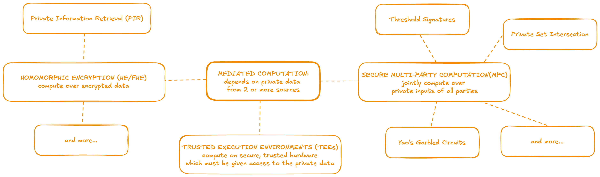

# Mediated Computation

Mediated computation is used when a party's private data is computed over either collaboratively or by another entity. In other words, the holder of the private input data and the entity performing the computation are not the same. A variety of technologies can perform mediated computation over private data to achieve different purposes. These can also often be combined together or with independent computations, such as ZKPs, depending on the requirements of the application.

## Fully Homomorphic Encryption (FHE)

Homomorphic Encryption is a cryptographic tool for performing computation over encrypted ciphertexts such that the decryption of the result is equivalent to the result which would be obtained by computing over the plaintext inputs. For more background, see the [definition](../../learning/definitions.md#homomorphic-encryption) and [resources](../../learning/resources.md) in the learning section.

### Use in programmable cryptography

FHE is useful for *outsourcing private computation*. A user with private data can encrypt it and share it. A remote entity computes over the ciphertext and sends back the result. The user decrypts the result, and the decrypted result of the FHE computation is the same as if the private data had been computed without encryption.

### Caveats

- The output is revealed by decrypting it with the decryption key. Thus, the management of the private data is fundamentally a key-management problem. FHE can be combined with an MPC threshold signature scheme to distribute this risk.

### Practical challenges & limitations
- 

## Secure Multi-Party Computation (MPC)

Secure Multi-Party Computation is *collaborative computation* over private inputs from multiple parties. It *reveals the output* to all parties, but *keeps each party's input private* from the other parties. For more background, see the [definition](../../learning/definitions.md#secure-multi-party-computation-mpc) and [resources](../../learning/resources.md) in the learning section.

### Use in programmable cryptography

In programmable cryptography it can serve the purpose of:
- computing shared private state, such as managing the state of a game world that is affected by the secret actions of multiple players
- aggregating private inputs from multiple parties

### Caveats

- The output is revealed to all participating parties, which can leak information about the private inputs. For example, in an auction where the winning bid is revealed, which can leak information about bidding patterns.
- Parties can collude, and this collusion is impossible to detect or punish, unless the effect of it is so obvious as to be socially noticeable

### Practical challenges & limitations

MPC has high communication overhead and is network-bound. Thus, the number of peers, latency, and transmission rates can all lead to delays in computation execution.

It's feasible for networks with:
- limited peers
- low latency
- high transmission rates

## Trusted Execution Environments (TEE)