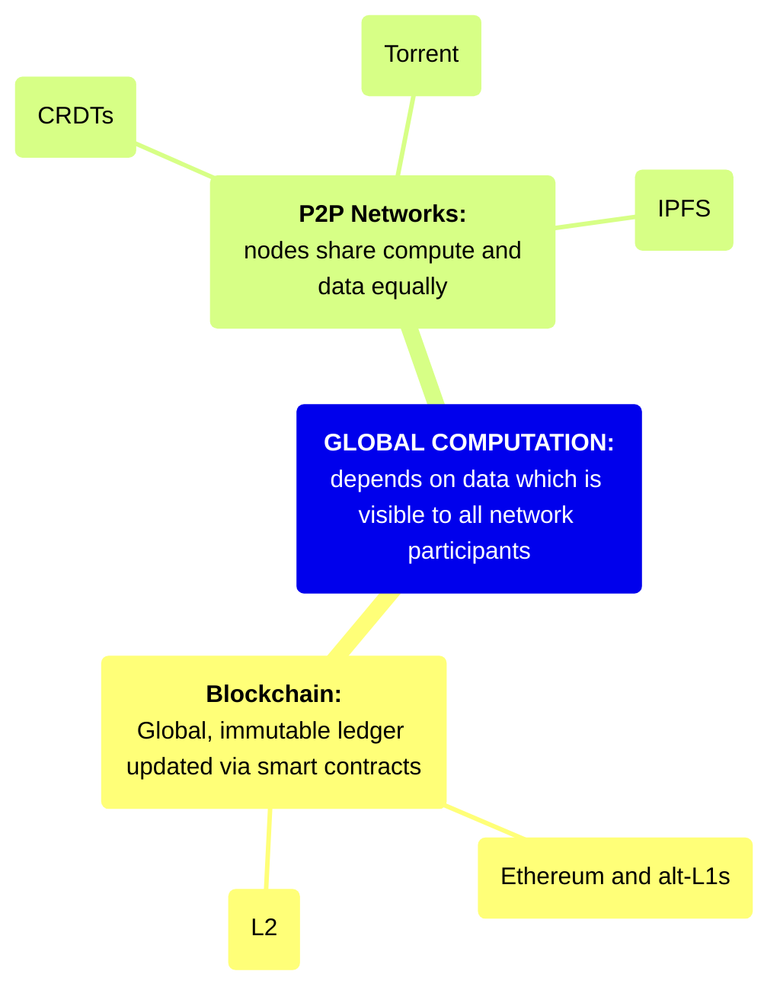

# Global Computation

```mermaid
mindmap
  glob("**GLOBAL COMPUTATION:**<br />depends on data which is visible to all network participants")
      ("**Blockchain:**<br />Global, immutable ledger updated via smart contracts")
        (Ethereum and alt-L1s)
        (L2)
      ("**P2P Networks:**<br /> nodes share compute and data equally")
        (CRDTs)
        (Torrent)
        (IPFS)
```