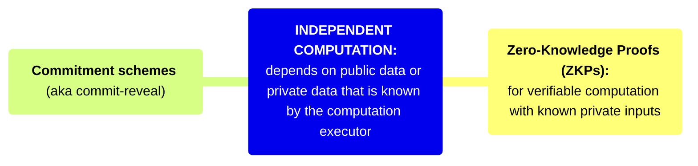

# Independent Computation

Independent computation is done by a single entity, so only that entity needs access to input data. Zero-Knowledge Proofs can be used to maintain privacy over the input data.

## Zero-Knowledge Proofs

**Use in Trust Infrastructure**

Zero knowledge proofs are useful for when private inputs are known and we want to reveal either some statement over those inputs or to selectively reveal only part of the statement.

## Commitment schemes

(informally: “Commit-Reveal”)

**Use in Trust Infrastructure**

Commitments are a common cryptographic primitive. Think of it like putting a message in a locked box and then giving the box to a receiver. Later, the receiver can open the box when the sender gives them a key.

**Technical Description**

Commitment schemes consist of two phases:

1. The *commit phase*, where a value is chosen and committed to — (e.g. the player *commits* to a value)
    1. Commitments make use of the *binding property.* This means the sender cannot cheat during the reveal phase and open the commitment to a different value than was initially chosen.
2. The *reveal phase* during which the value is revealed by the sender, then the receiver verifies its authenticity.
    1. Commitments also make use of the *hiding property.* This means the receiver cannot open the commitment (and reveal inside) until the sender allows them to do so.

## References

- [Intro to Zero Knowledge](https://consensys.io/blog/introduction-to-zk-snarks)
- [ZK Math Intution](https://vitalik.eth.limo/general/2021/01/26/snarks.html)
- [ZK Whiteboard Sessions](https://zkhack.dev/whiteboard/)
- [Resources from the 0xPARC Applied Learning Group](https://learn.0xparc.org/)
- [ZK Docs](https://www.zkdocs.com/)
- [ZK Jargon Decoder](https://nmohnblatt.github.io/zk-jargon-decoder/)
- [Proofs, Arguments, and Zero Knowledge by Justin Thaler](https://people.cs.georgetown.edu/jthaler/ProofsArgsAndZK.pdf)