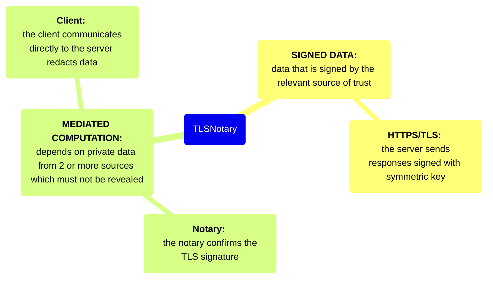

# Primitives, tools, and platforms

## [Semaphore](https://semaphore.pse.dev/)

---

**Capabilities**

a zero-knowledge protocol that allows you to cast a message (for example, a vote or endorsement) as a provable group member without revealing your identity.

## Storage Proofs

---

**Capabilities**

Relatively efficient for making cross-chain claims

**Present Limitations**

The verifier (on-chain or off-chain) must have access to an archive of block header hashes from the source chain.

**Companies & Projects**

Herodotus

## [TLSNotary](https://tlsnotary.org/)

---

**Capabilities**

Generates attestations over arbitrary data obtained over a TLS connection (e.g. API responses) using a designated verifier (the “notary”)

**Present Limitations**

TLS handshake during connection open for only 10 to 20s, so full MPC TLS protocol needs to be able to upload 4-10MB within 10-20s (basically, means it doesn't work nice on bad networks) In fact, MPC stuff in general not going to work for places of poor connectivity.

Need both good bandwidth and good latency — so identifying optimal Notary is point of optimization.

Can only notarize 21kb atm, so small Json responses from APIs works. More bandwidth and lower latency is needed for larger notarization lengths. Techniques in FHE or outsourcing some computation into a trustless coordinator can reduce network overhead and improve UX.

Also more efficient operations in circuit (lower constants), new techniques (IVC) and better hardware will help here as well to allow for generating proofs over larger ciphertexts.

UX issues to solve — need a clean way for users to enter into a TLS notary MPC protocol. Best approach right now is extension, but extensions do come with friction.

The notary can create arbitrary false claims by colluding with itself. Therefore TLS notary is most secure when the verifier is also the notary.

## Web Proofs

---

Prove arbitrary web data sent over TLS.

**Present Limitations**

Implementations require trust assumptions on centralized actors. Approaches either do a 2PC handshake (like TLS Notary), introducing a “designated verifier” trust assumption or they use a proxy, requiring trust in the proxy.

**Companies & Projects**

[Pluto](https://pluto.xyz/)

[Reclaim Protocol](https://www.reclaimprotocol.org/)

[zkPass](https://www.zkpass.org/)

## ZK-coprocessors

---

**Companies & Projects**

- [Axiom](https://www.axiom.xyz/)
- [Brevis](https://docs.brevis.network/)
- [Lagrange ZK Coprocessor](https://www.lagrange.dev/zk-coprocessor)
- 

## [zk-passport-circuits (Rarimo)](https://github.com/rarimo/passport-zk-circuits)

**Capabilities**

Allows for proof of biometric passport data

**Limitations**

Scanning the passport can be difficult, especially for non-technical users, since the location of the biometric chip varies by country and the location of the NFC scanner varies by phone.

## [ZKEmail](https://github.com/zkemail)

---

**Capabilities**

allows for anonymous verification of email signatures while masking specific data

**Limitations**

ZKRegex is a relatively brittle format for e-mails whose layouts and copy are frequently changed

## ZKML

---

**Capabilities**

MNIST sized inference < 1s & 180MB RAM
Decision Trees

**Present Limitations**

State of the Art CNNs from ~10 years ago?

**Companies & Projects**

EZKL