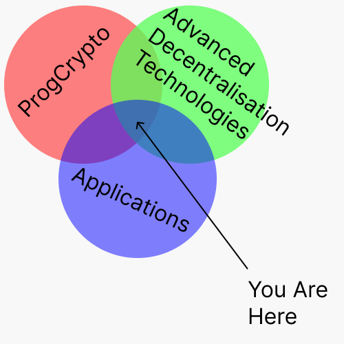

# Introduction

Welcome to the wiki on 
- programmable cryptography 
- and advanced decentralisation technologies 
- for novel, emergent applications

# Why Wiki 

1. A single channel to surface the latest projects, tools, and resources related to the above intersections. 
2. Education on how these technologies may be used to build novel applications.
3. Coverage on emergent use cases for these technologies.

We use the computational framework from [SoK: Programmable Privacy in Distributed Systems](https://eprint.iacr.org/2024/982.pdf) to organize the structure of applications and associated technologies. 

# Contribution 

If you would like to contribute to the wiki, we would be happy to see a pull request from you. There are no major guidelines other than to keep things tidy. Make your changes succinct and targeted.

# Contact
The Knot Group is headed by Goblin Oats, Grjte and their friends. If you are a friend of a friend and would like to get in touch with us then please reach out to [Tonk](https://tonk.xyz).