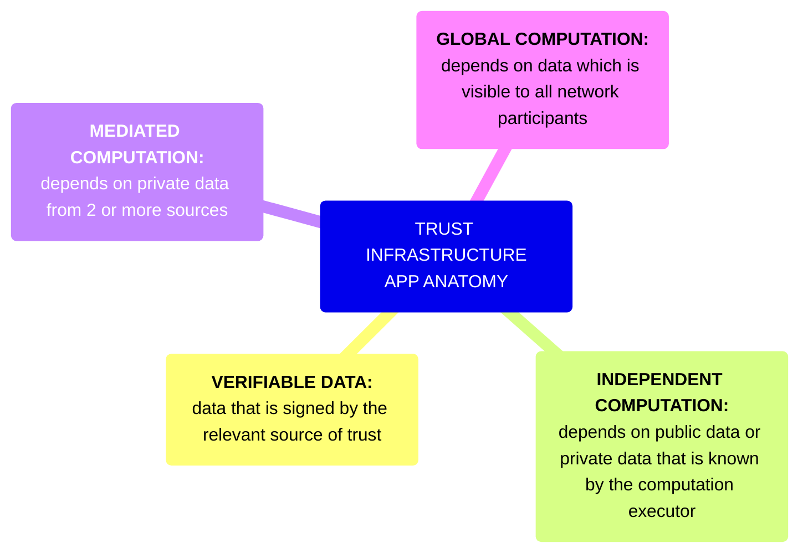
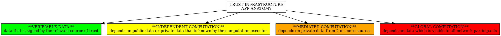

# Introduction

Welcome to the Knot Group Wiki on Trust Infrastructure, Programmable Cryptography and other Advanced Decentralisation Technologies.

# Introduction

This wiki aims to present a live overview of the technology and application landscape outlined above. Throughout this document, we use the computational framework from [SoK: Programmable Privacy in Distributed Systems](https://eprint.iacr.org/2024/982.pdf) which is represented in the mindmap.

# Contact

The Knot-Group is headed by Goblin Oats, grjte and their friends. If you are a friend of a friend and would like to get in touch then please reach out to [Tonk](https://tonk.xyz).