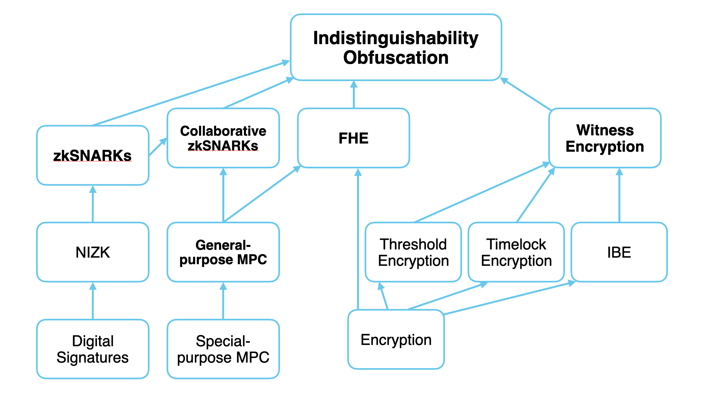

# Research

source: [Programmable Cryptogrpahy (Part 1)](https://0xparc.org/blog/programmable-cryptography-1). The labels in bold represent *Programmable Cryptography*. A simplified tech tree by gubsheep which offers us a reasonable overview of what kinds of research are pushing us up the tech tree. 

The research section focuses primarily on research concerning the labels in bold.

# Out of Scope 
For the moment, **Indistinguishability Obfuscation** and **Witness Encryption** are completely out of reach, although techniques for witness encryption in some limited forms do exist. 

**Quantum Cryptography** promises some very [weird capabilities](https://en.wikipedia.org/wiki/Quantum_money). However, we are still sufficiently far off from widespread quantum computing to warrant coverage.
